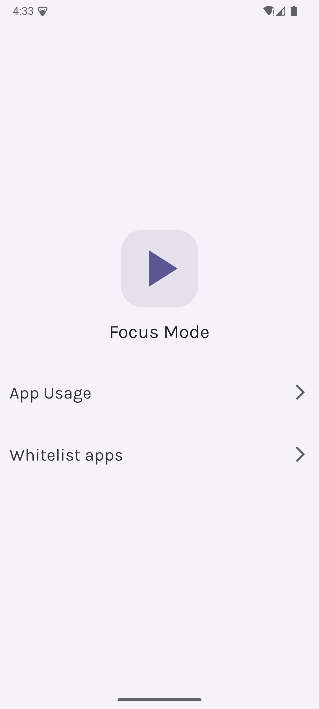

# Reef - Focus and Productivity

Reef is a simple and minimalistic productivity tool that helps you focus on your tasks and get things done. It is designed to be simple and easy to use, with a clean and intuitive interface that helps you stay focused on your work.

## Features

- Focus mode to help you concentrate on your tasks
- Per app screen time limits
- Block distracting apps
- Whitelist apps that you need to access
- Simple and intuitive interface
- Material You

## Installation

Reef is available on the Google Play Store. You can download it from [here](https://play.google.com/store/apps/details?id=dev.pranav.reef).

## Screenshots

    
    
    
    

    
    
    

